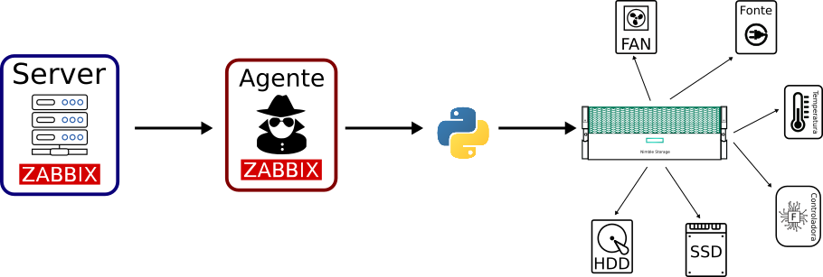
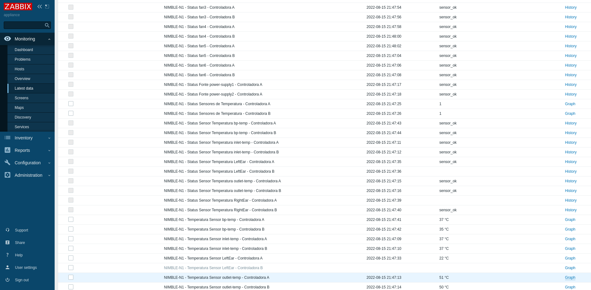

<h1 align="center">MONITORAMENTO NIMBLE</h1>

   

Devido a necessidade de monitorar os Storages NIMBLE HPE pelo ZABBIX, foi desenvolvido esse projetpo para consultar todos os dados das controladoras e dos HD's dos Storages.

Abaixo um exemplo do Zabbix Server monitorando o Sotarage Nimble.

## Índice
* [Funcionameto](#funcionameto)
* [Referências](#referências)

## Funcionamento

Esse projeto é composto por duas partes:
1° - [Zabbix](#1°-zabbix)
2° - [Nimble](#2°-nimble)

#### 1° Zabbix

No Zabbix Server com o código [cria_template_Nimble.py](cod/Zabbix/cria_templates_Nimble.py) é criado dois templates "NIMBEL-Controllers" e "NIMBLE-Disks" os quais possuem um item responsável por executar os códigos de consulta e salvar todos os dados num arquivo de texto no /tmp, e outros itens resposáveis por filtrarem os dados desses arquivos salvos no /tmp.  

#### 2° Nimble
Para fazer a consulta dos dados do Nimble é utilizada a biblioteca [nimble-python-sdk](https://github.com/hpe-storage/nimble-python-sdk), com ela foi desenvolvido dois códigos, [consulta_controllers.py](cod/Nimble/consulta_controllers.py) faz a consulta dos status das controladoras e [consulta_disks.py](cod/Nimble/consulta_disks.py) que faz a consulta dos status dos discos SSD e HD.

## Utilização

Esse procedimento pode ser feito de qualquer máquina com conexão ao Zabbix Server. 
1° -  Instalar a biblioteca requests :
`
pip install requests
`
2° - Executar o código [cria_template_Nimble.py](cod/Zabbix/cria_templates_Nimble.py):
`
python cria_templates_Nimble.py --usuario <Nome_Usuário> --senha <Senha usada no Nimble> --url <URL_Zabbix>  --ip_Nimble <IP do Nimble> --usr_Nimble <Usuario Nimble> --pas_Nimble <Senha Nimble>
`
Exemplo: 
`
python cria_templates_Nimble.py --usuario 'Admin' --senha 'zabbix' --url 'http://192.168.100.244/api_jsonrpc.php' 
                                             --ip_Nimble '10.10.10.10' --usr_Nimble 'admin' --pas_Nimble 'admin'
`
 
3° - Adicionar ao host que tem conexão com o storage  os templates NIMBLE-Controllers-N1 e NIMBLE_Disks-N1.
Obs: Um dos intens dos templates é o item system.run e para funcionar esse item é necessário editar o campo EnableRemoteCommands para EnableRemoteCommands=1 do arquivo /etc/zabbix/zabbix_agentd.conf
 
Na máquina do zabbix agente:
1° instalar as bibliotecas pandas e nimble-sdk:
`
pip install pandas nimble-sdk
`
2° Copiar os códigos [consulta_controllers.py](cod/Nimble/consulta_controllers.py), [consulta_disks.py](cod/Nimble/consulta_disks.py) para a pasta **/home** 

OBS: Comando para testar o código:
`
python consulta_controllers.py --ip <IP_do_NIMBLE> --usuario <Nome_Usuário> --senha <Senha usada no Nimble>
`

## Referências 

- [nimble-python-sdk](https://github.com/hpe-storage/nimble-python-sdk)
- [API Zabbix](https://www.zabbix.com/documentation/current/en/manual/api)